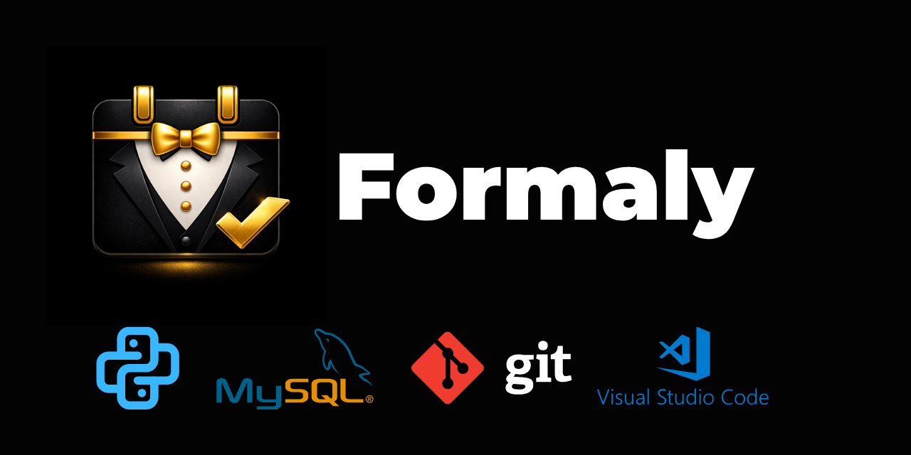

FORMALY
________________________
Formaly is an application that helps users manage every part of Year 12 formal planning in an organised and efficient way. It brings all tasks into one place, supports different permission levels for staff and makes the entire event process easier to control from start to finish.

OVERVIEW
________________________
Formaly provides a complete planning environment for schools preparing their Year 12 formal. It combines event organisation, staff coordination, student management and live event tools into one system. The platform is designed to reduce confusion, improve communication and ensure that every stage of the formal is handled efficiently.

KEY FEATURES
________________________
Centralised planning - All event information stored in one system.

Role based access - Permissions for planners, support staff and administrators.

Student management - Attendance, dietary needs and table allocation

Live event tools - Real time updates and on the day coordination

Task tracking - Clear progress indicators for each planning stage

SYSTEM STRUCTURE
________________________
Formaly is built around a clear workflow that guides staff from early planning to final execution. The system includes modules for student data, event logistics, communication and live event control. Each module works together to create a smooth experience.

INSTALLATION
________________________
...

